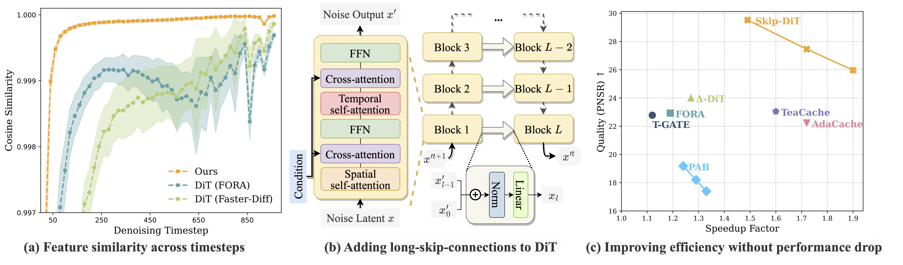
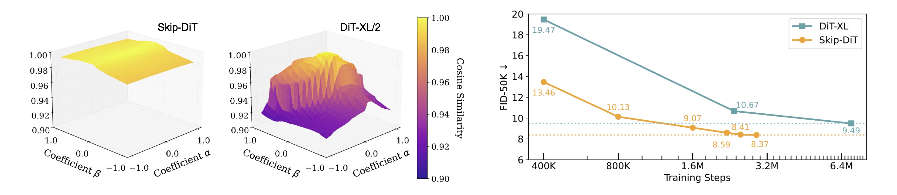
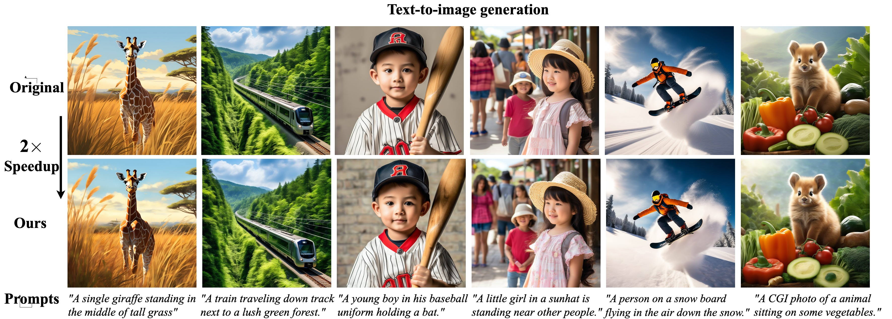
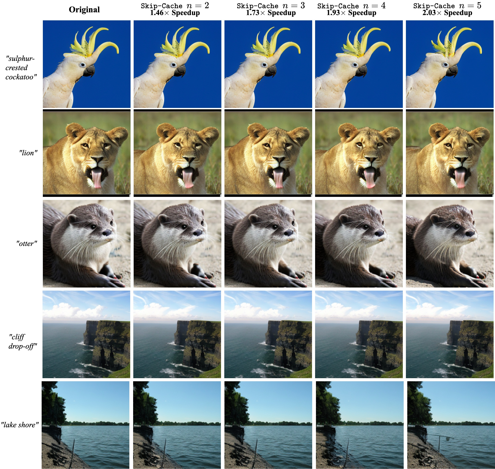

<div align="center">
  
# Towards Stabilized and Efficient Diffusion Transformers through Long-Skip-Connections with Spectral Constraints
  
  ${{\color{Red}\Huge{\textsf{  ICCV\ 2025\ \}}}}\$

  <a href="https://github.com/OpenSparseLLMs/Skip-DiT"></a> &ensp;
  <a href="https://arxiv.org/abs/2411.17616"></a> &ensp;
  <a href="https://huggingface.co/GuanjieChen/Skip-DiT"></a> &ensp;
  <a href="https://huggingface.co/datasets/GuanjieChen/video_seg"></a> &ensp;
</div>


<div align="center">
  </img>
  <br>
  <em>
      (a) Skip-DiT presents consistently higher feature similarity under caching, demonstrating superior stability. (b) Illustration of Skip-DiT. (c) Skip-DiT maintains higher generation quality even at greater speedup factors.
  </em>
</div>
<be>

## 🎉 Abstract
This repository contains the official PyTorch implementation of the paper: **[Towards Stabilized and Efficient Diffusion Transformers through Long-Skip-Connections with Spectral Constraints](https://arxiv.org/abs/2411.17616)**. 

Diffusion Transformers (DiT) have emerged as a powerful architecture for image and video generation, offering superior quality and scalability. However, their practical application suffers from inherent dynamic feature instability, leading to error amplification during cached inference. Through systematic analysis, we identify the absence of long-range feature preservation mechanisms as the root cause of unstable feature propagation and perturbation sensitivity. To this end, we propose Skip-DiT, an image and video generative DiT variant enhanced with Long-Skip-Connections (LSCs) - the key efficiency component in U-Nets. Theoretical spectral norm and visualization analysis demonstrate how LSCs stabilize feature dynamics. Skip-DiT architecture and its stabilized dynamic feature enable an efficient statical caching mechanism that reuses deep features across timesteps while updating shallow components. Extensive experiments across the image and video generation tasks demonstrate that Skip-DiT achieves: (1) 4.4x training acceleration and faster convergence, (2) 1.5-2x inference acceleration with negligible quality loss and high fidelity to the original output, outperforming existing DiT caching methods across various quantitative metrics.Our findings establish Long-Skip-Connections as critical architectural components for stable and efficient diffusion transformers.
More visualizations can be found [here](#visualization).

<!-- > [**Accelerating Vision Diffusion Transformers with Skip Branches**](https://arxiv.org/abs/2411.17616)<br>
> [Guanjie Chen](https://scholar.google.com/citations?user=cpBU1VgAAAAJ&hl=zh-CN), [Xinyu Zhao](https://scholar.google.com/citations?hl=en&user=1cj23VYAAAAJ),[Yucheng Zhou](https://scholar.google.com/citations?user=nnbFqRAAAAAJ&hl=en), [Tianlong Chen](https://scholar.google.com/citations?user=LE3ctn0AAAAJ&hl=en), [Yu Cheng](https://scholar.google.com/citations?user=ORPxbV4AAAAJ&hl=en)         
> (contact us: chenguanjie@sjtu.edu.cn, xinyu@cs.unc.edu) -->

## 🌟 Feature Stability of Skip-DiT

Visualization of the feature stability of Skip-DiT compared with vanilla DiT. Skip-DiT also shows superior training efficiency.

## Gallery
<div align="center">
  </img>
  <br>
  <em>
      (Results of Latte with skip-branches on text-to-video and class-to-video tasks with Latte. Left: text-to-video with 1.7x and 2.0x speedup. Right: class-to-video with 2.2x and 2.4x speedup. Latency is measured on one A100.) 
  </em>
</div>
<br>

<div align="center">
  </img>
  <br>
  <em>
      (Results of HunYuan-DiT with skip-branches on text-to-image task with Hunyuan-DiT. Latency is measured on one A100.) 
  </em>
</div>
<be>


## Released Checkpoints
| Model | Task | Training Data | Backbone | Size(G) | Skip-Cache |
|:--:|:--:|:--:|:--:|:--:|:--:|
| [Latte-skip](https://huggingface.co/GuanjieChen/Skip-DiT/blob/main/DiT-XL-2-skip.pt) | text-to-video |Vimeo|Latte|8.76| ✅ |
| [DiT-XL/2-skip](https://huggingface.co/GuanjieChen/Skip-DiT/blob/main/Latte-skip.pt) | class-to-image |ImageNet|DiT-XL/2|11.40|✅ |
| [ucf101-skip](https://huggingface.co/GuanjieChen/Skip-DiT/blob/main/ucf101-skip.pt) | class-to-video|UCF101|Latte|2.77|✅ |
| [taichi-skip](https://huggingface.co/GuanjieChen/Skip-DiT/blob/main/taichi-skip.pt) | class-to-video|Taichi-HD|Latte|2.77|✅ |
| [skytimelapse-skip](https://huggingface.co/GuanjieChen/Skip-DiT/blob/main/skylapse-skip.pt) | class-to-video|SkyTimelapse|Latte|2.77|✅ |
| [ffs-skip](https://huggingface.co/GuanjieChen/Skip-DiT/blob/main/ffs-skip.pt) | class-to-video|FaceForensics|Latte|2.77|✅ |

Pretrained text-to-image Model of [HunYuan-DiT](https://github.com/Tencent/HunyuanDiT) can be found in [Huggingface](https://huggingface.co/Tencent-Hunyuan/HunyuanDiT-v1.2/tree/main/t2i/model) and [Tencent-cloud](https://dit.hunyuan.tencent.com/download/HunyuanDiT/model-v1_2.zip).

Training dataset for Latte-skip on text-to-video task is released [here](https://huggingface.co/datasets/GuanjieChen/video_seg)

## 🚀 Usage
### Text-to-video Inference
To generate videos with Latte-skip, you just need 3 steps
```shell
# 1. Prepare your conda environments
cd text-to-video ; conda env create -f environment.yaml ; conda activate latte
# 2. Download checkpoints of Latte and Latte-skip
python download.py
# 3. Generate videos with only one command line!
python sample/sample_t2v.py --config ./configs/t2v/t2v_sample_skip.yaml
# 4. (Optional) To accelerate generation with skip-cache, run following command
python sample/sample_t2v.py --config ./configs/t2v/t2v_sample_skip_cache.yaml --cache N2-700-50
```
### Text-to-image Inference
In the same way, to generate images with Hunyuan-DiT, you only need 3 steps
```shell
# 1. Prepare your conda environments
cd text-to-image ; conda env create -f environment.yaml ; conda activate HunyuanDiT
# 2. Download checkpoints of Hunyuan-DiT
mkdir ckpts ; huggingface-cli download Tencent-Hunyuan/HunyuanDiT-v1.2 --local-dir ./ckpts
# 3. Generate images with only one command line!
python sample_t2i.py --prompt "渔舟唱晚"  --no-enhance --infer-steps 100 --image-size 1024 1024
# 4. (Optional) To accelerate generation with skip-cache, run the following command
python sample_t2i.py --prompt "渔舟唱晚"  --no-enhance --infer-steps 100 --image-size 1024 1024 --cache --cache-step 2
```

About the class-to-video and class-to-image task, you can found detailed instructions in `class-to-video/README.md` and `class-to-image/README.md`

### Training
We have already released the training code of Latte-skip! It takes only a few days on 8 H100 GPUs. To train the text-to-video model:
1. Prepare your text-video datasets and implement the `text-to-video/datasets/t2v_joint_dataset.py`
2. Run the two-stage training strategy:
   1. Freeze all the parameters except skip-branches. Set `freeze=True` in `text-to-video/configs/train_t2v.yaml`. And then run the training scripts at `text-to-video/train_scripts/t2v_joint_train_skip.sh`.
   2. Overall training. Set `freeze=False` in `text-to-video/configs/train_t2v.yaml`. And then run the training scripts.
**The text-to-video model we released is trained with only 300k text-video pairs of Vimeo for around 1 week on 8 H100 GPUs.**

The training instructions of `class-to-video` and `text-to-video` tasks can be found in `class-to-video/README.md` and `class-to-image/README.md`


## Acknowledgement
Skip-DiT has been greatly inspired by the following amazing works and teams: [DeepCache](https://arxiv.org/abs/2312.00858), [Latte](https://github.com/Vchitect/Latte), [DiT](https://github.com/facebookresearch/DiT), and [HunYuan-DiT](https://github.com/Tencent/HunyuanDiT), we thank all the contributors for open-sourcing.


## License
The code and model weights are licensed under [LICENSE](./class-to-image/LICENSE).


## Visualization
##### Class-to-image

##### Text-to-image

##### Text-to-Video

##### Class-to-Video


