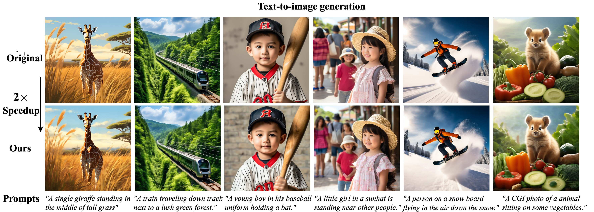
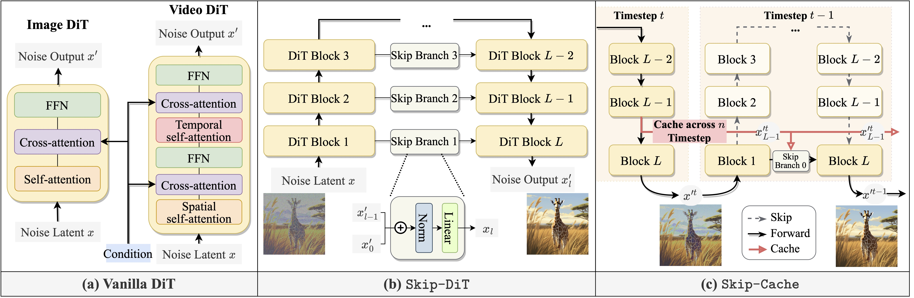
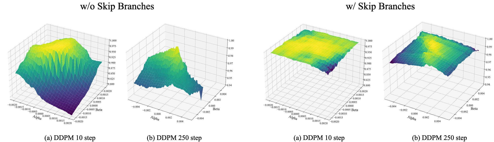
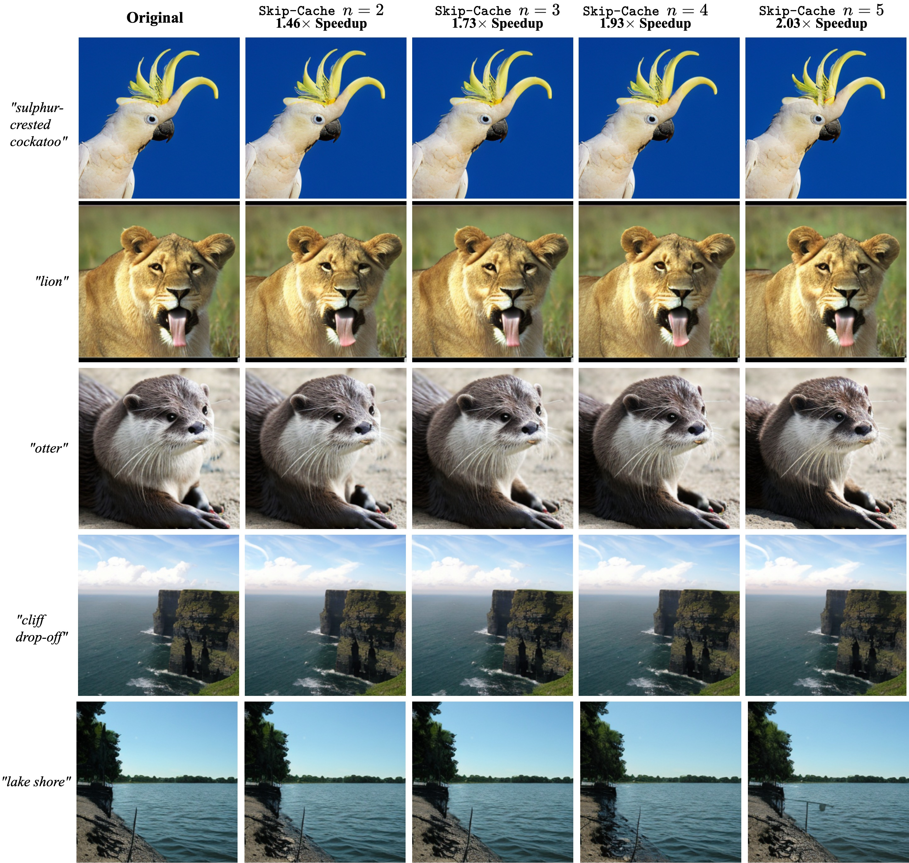

# Accelerating Vision Diffusion Transformers with Skip Branches
<div align="center">
  <a href="https://github.com/OpenSparseLLMs/Skip-DiT"></a> &ensp;
  <a href="https://github.com/OpenSparseLLMs/Skip-DiT"></a> &ensp;
  <a href="https://huggingface.co/GuanjieChen/Skip-DiT"></a> &ensp;
</div>

### About

This repository contains the official PyTorch implementation of the paper: **[Accelerating Vision Diffusion Transformers with Skip Branches]()**. In this work, we enhance standard DiT models by introducing **Skip-DiT**, which incorporates skip branches to improve feature smoothness. We also propose **Skip-Cache**, a method that leverages skip branches to cache DiT features across timesteps during inference.The effectiveness of our approach is validated on various DiT backbones for both video and image generation, demonstrating how skip branches preserve generation quality while achieving significant speedup. Experimental results show that **Skip-Cache** provides a $1.5\times$ speedup with minimal computational cost and a $2.2\times$ speedup with only a slight reduction in quantitative metrics. All the codes and checkpoints are publicly available at [huggingface](https://huggingface.co/GuanjieChen/Skip-DiT/tree/main) and [github](https://github.com/OpenSparseLLMs/Skip-DiT.git). More visualizations can be found [here](#visualization).

### Demo
<div align="center">
  </img>
  <br>
  <em>
      (Results of Latte with skip-branches on text-to-video and class-to-video tasks. Left: text-to-video with 1.7x and 2.0x speedup. Right: class-to-video with 2.2x and 2.5x speedup. Latency is measured on one A100.) 
  </em>
</div>
<br>

<div align="center">
  </img>
  <br>
  <em>
      (Results of HunYuan-DiT with skip-branches on text-to-image task. Latency is measured on one A100.) 
  </em>
</div>
<br>

<!-- >**Accelerating Vision Diffusion Transformers with Skip Branches**
>
> [Guanjie Chen](), [Xinyu Zhao](),[Yucheng Zhou](), [Tianlong Chen](), [Yu Cheng]()
>
> [Arxiv](), [Huggingface](https://huggingface.co/GuanjieChen/Skip-DiT/tree/main) -->


### Skip-DiT and Skip-Cache

Illustration of Skip-DiT and Skip-Cache for DiT visual generation caching. (a) The vanilla DiT block for image and video generation. (b) Skip-DiT modifies the vanilla DiT model using skip branches to connect shallow and deep DiT blocks. (c) Given a Skip-DiT with $L$ layers, during inference, at the $t-1$ step, the first layer output  ${x'}^{t-1}\_{0}$ and cached $L-1$ layer output ${x'}^t_{L-1}$ are forwarded through the skip branches to the final DiT block to generate the denoising output, without executing DiT blocks 2 to $L-1$.

### Feature Smoothness

Feature smoothness analysis of DiT in the class-to-video generation task using DDPM. Normalized disturbances, controlled by strength coefficients $\alpha$ and $\beta$, are introduced to the model with and without skip connections. We compare the similarity between the original and perturbed features. The feature difference surface of Latte, with and without skip connections, is visualized at steps 10 and 250 of DDPM. The results show significantly better feature smoothness in Skip-DiT. Furthermore, we identify feature smoothness as a critical factor limiting the effectiveness of cross-timestep feature caching in DiT. This insight provides a deeper understanding of caching efficiency and its impact on performance.

### Pretrained Model
| Model | Task | Training Data | Backbone | Size(G) | Skip-Cache |
|:--:|:--:|:--:|:--:|:--:|:--:|
| [Latte-skip](https://huggingface.co/GuanjieChen/Skip-DiT/blob/main/DiT-XL-2-skip.pt) | text-to-video |Vimeo|Latte|8.76| ✅ |
| [DiT-XL/2-skip](https://huggingface.co/GuanjieChen/Skip-DiT/blob/main/Latte-skip.pt) | class-to-image |ImageNet|DiT-XL/2|11.40|✅ |
| [ucf101-skip](https://huggingface.co/GuanjieChen/Skip-DiT/blob/main/ucf101-skip.pt) | class-to-video|UCF101|Latte|2.77|✅ |
| [taichi-skip](https://huggingface.co/GuanjieChen/Skip-DiT/blob/main/taichi-skip.pt) | class-to-video|Taichi-HD|Latte|2.77|✅ |
| [skytimelapse-skip](https://huggingface.co/GuanjieChen/Skip-DiT/blob/main/skylapse-skip.pt) | class-to-video|SkyTimelapse|Latte|2.77|✅ |
| [ffs-skip](https://huggingface.co/GuanjieChen/Skip-DiT/blob/main/ffs-skip.pt) | class-to-video|FaceForensics|Latte|2.77|✅ |

Pretrained text-to-image Model of [HunYuan-DiT](https://github.com/Tencent/HunyuanDiT) can be found in [Huggingface](https://huggingface.co/Tencent-Hunyuan/HunyuanDiT-v1.2/tree/main/t2i/model) and [Tencent-cloud](https://dit.hunyuan.tencent.com/download/HunyuanDiT/model-v1_2.zip).
### Installation
To prepare environments for `class-to-video`, `text-to-video` tasks, please refer to [Latte](https://github.com/Vchitect/Latte) or you can:
```shell
cd class-to-video
conda env create -f environment.yaml
conda activate latte
```

To prepare environments for `class-to-image` task, please refer to [DiT](https://github.com/facebookresearch/DiT) or you can:
```shell
cd class-to-image
conda env create -f environment.yaml
conda activate DiT
```

To prepare environments for text-to-image task, please refer to [Hunyuan-DiT](https://github.com/Tencent/HunyuanDiT):
```shell
cd text-to-image
conda env create -f environment.yaml
conda activate HunyuanDiT
```

### Download pretrained models
To download models, first install:
```shell
python -m pip install "huggingface_hub[cli]"
```
To download models needed in text-to-video task:
```shell
# 1. Download the vae, encoder, tokenizer and orinal checkpoints of Latte. Models are download default to ./text-to-video/pretrained/
cd text-to-video
python pretrained/download_ckpts.py

# 2. Download the checkpoint of Latte-skip
huggingface-cli download GuanjieChen/Skip-DiT/Latte-skip.pt -d ./pretrained/
```

To download models needed in class-to-video tasks.
```shell
cd class-to-video
# 1. Download vae models and original checkpoints of Latte:
python pretrained/download_ckpts.py

# 2. Download the checkpoint of Latte-skip
task_name=ffs # or UCF101, skytimelapse, taichi
huggingface-cli download GuanjieChen/Skip-DiT/${task}-skip.pt -d ./pretrained/
```

To download models needed in text-to-image task:
```shell
cd text-to-image
mkdir ckpts
huggingface-cli download Tencent-Hunyuan/HunyuanDiT-v1.2 --local-dir ./ckpts
```

To download models needed in class-to-image task:
```shell
cd class-to-image
mkdir ckpts
# 1. download DiT-XL/2
wget -P ckpts https://dl.fbaipublicfiles.com/DiT/models/DiT-XL-2-256x256.pt
# 2. download DiT-XL/2-skip
huggingface-cli download GuanjieChen/Skip-DiT/DiT-XL-2-skip.pt -d ./ckpts
```

### Inference & Acceleration
To infer with text-to-video models:
```shell
cd text-to-video
# 1. infer with original latte
./sample/t2v.sh
# 2. infer with skip dit
./sample/t2v_skip.sh
# 3. accelerate with skip-cache
./sample/t2v_skip_cache.sh
```

To infer with class-to-video models:
```shell
task_name=ffs # or UCF101, skytimelapse, taichi-hd
cd class-to-video
# 1. infer with original latte
./sample/${task_name}.sh
# 2. infer with skip dit
./sample/${task_name}_skip.sh
# 3. accelerate with skip-cache
./sample/${task_name}_cache.sh
```

To infer with text-to-image model, please follow the instructions in the official implementation of [HunYuan-DiT](https://github.com/Tencent/HunyuanDiT.git). To use **Skip-Cache**, add the following command to inference scripts `./infer.sh`:
```shell
--deepcache -N {2,3,4...}
```


To infer with class-to-image models:
```shell
cd class-to-image
# 1. infer with DiT-XL/2
python sample.py --ckpt path/to/DiT-XL-2.pt --model DiT-XL/2
# 2. infer with DiT-XL/2-skip
python sample.py --ckpt path/to/DiT-XL-2-skip.pt --model DiT-skip
# 3. accelerate with skip-cache
python sample.py --ckpt path/to/DiT-XL-2-skip.pt --model DiT-cache-2 # or DiT-cache-3, DiT-cache-4...
```

### Training
To train the DiT-XL/2-skip:
1. Download the [ImageNet](https://www.image-net.org/) dataset.
2. Implement the TODO in the train.py
3. run the script `run_train.sh`

To train the class-to-video models:
1. Download the datasets offered by [Xin Ma](https://huggingface.co/maxin-cn) in huggingface: [skytimelapse](Skip-DiT-open/maxin-cn/SkyTimelapse), [taichi](Skip-DiT-open/maxin-cn/Taichi-HD), [ffs](Skip-DiT-open/maxin-cn/FaceForensics). And you have to download [ucf101](https://www.crcv.ucf.edu/data/UCF101/UCF101.rar) from the website.
2. Implement the TODOs in the training configs under `class-to-video/configs`
3. Run the training scripts under `class-to-image/train_scripts`

To train the text-to-video model:
1. Prepare your text-video datasets and implement the `text-to-video/datasets/t2v_joint_dataset.py`
2. Run the two-stage training strategy:
   1. Freeze all the parameters except skip-branches. Set `freeze=True` in `text-to-video/configs/train_t2v.yaml`. And then run the training scripts.
   2. Overall training. Set `freeze=False` in `text-to-video/configs/train_t2v.yaml`. And then run the training scripts.

### Acknowledgement
Skip-DiT has been greatly inspired by the following amazing works and teams: [DeepCache](https://arxiv.org/abs/2312.00858), [Latte](https://github.com/Vchitect/Latte), [DiT](https://github.com/facebookresearch/DiT), and [HunYuan-DiT](https://github.com/Tencent/HunyuanDiT), we thank all the contributors for open-sourcing.

### License
The code and model weights are licensed under [LICENSE](./class-to-image/LICENSE).


### Visualization
#### Text-to-Video

#### Class-to-Video

#### Text-to-image

#### Class-to-image

