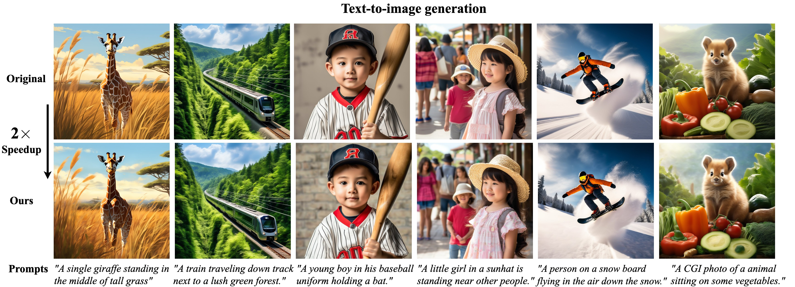

# Accelerating Vision Diffusion Transformers with Skip Branches

<div align="center">
  <a href="https://github.com/OpenSparseLLMs/Skip-DiT"></a> &ensp;
  <a href="https://arxiv.org/abs/2411.17616"></a> &ensp;
  <a href="https://huggingface.co/GuanjieChen/Skip-DiT"></a> &ensp;
</div>

<div align="center">
  </img>
  <br>
  <em>
      (Results of Latte with skip-branches on text-to-video and class-to-video tasks with Latte. Left: text-to-video with 1.7x and 2.0x speedup. Right: class-to-video with 2.2x and 2.4x speedup. Latency is measured on one A100.) 
  </em>
</div>
<br>

<div align="center">
  </img>
  <br>
  <em>
      (Results of HunYuan-DiT with skip-branches on text-to-image task with Hunyuan-DiT. Latency is measured on one A100.) 
  </em>
</div>
<be>

### 🎉🎉🎉 About
This repository contains the official PyTorch implementation of the paper: **[Accelerating Vision Diffusion Transformers with Skip Branches](https://arxiv.org/abs/2411.17616)**. In this work, we enhance standard DiT models by introducing **Skip-DiT**, which incorporates skip branches to improve feature smoothness. We also propose **Skip-Cache**, which leverages skip branches to cache DiT features across timesteps during inference. The effectiveness of our approach is validated on various DiT backbones for both video and image generation, demonstrating how skip branches preserve generation quality while achieving significant speedup. Experimental results show that **Skip-Cache** provides a $1.5\times$ speedup with minimal computational cost and a $2.2\times$ speedup with only a slight reduction in quantitative metrics. All the codes and checkpoints are publicly available at [huggingface](https://huggingface.co/GuanjieChen/Skip-DiT/tree/main) and [github](https://github.com/OpenSparseLLMs/Skip-DiT.git). More visualizations can be found [here](#visualization).

> [**Accelerating Vision Diffusion Transformers with Skip Branches**](https://arxiv.org/abs/2411.17616)<br>
> [Guanjie Chen](https://scholar.google.com/citations?user=cpBU1VgAAAAJ&hl=zh-CN), [Xinyu Zhao](https://scholar.google.com/citations?hl=en&user=1cj23VYAAAAJ),[Yucheng Zhou](https://scholar.google.com/citations?user=nnbFqRAAAAAJ&hl=en), [Tianlong Chen](https://scholar.google.com/citations?user=LE3ctn0AAAAJ&hl=en), [Yu Cheng](https://scholar.google.com/citations?user=ORPxbV4AAAAJ&hl=en)         
> (contact us: chenguanjie@sjtu.edu.cn, xinyu@cs.unc.edu)

### 🔥 News
(🔥News) Dec 12, 2024🔥 [**Latte-Skip**](https://huggingface.co/GuanjieChen/Skip-DiT/tree/main) is now fully released 🎉, which is the **First Text-to-Video Model with Skip-Branches**, and can be accelerated 2x for free with **Skip-Cache**! You can generate videos with only [**3 command lines**](#text-to-video-inference)!

<video controls loop src="https://github.com/user-attachments/assets/90878b0e-ff69-415a-b786-e0b6587b0a0b" type="video/mp4"></video>
(Visualizations of Latte-Skip. You can replicate them [here](#text-to-video-inference))

(🔥News) Nov 26, 2024🔥 The training and inference code for **Skip-DiT** is publicly available 🎉, along with all corresponding checkpoints (DiT-XL/2, FaceForensics, SkyTimelapse, UCF101, and Taichi-HD), which can be accessed [here](https://huggingface.co/GuanjieChen/Skip-DiT/tree/main). Additionally, these models, including Hunyuan-DiT, are fully compatible with **Skip-Cache** for enhanced efficiency.

### 🔍 Pipeline of Skip-DiT and Skip-Cache

Illustration of Skip-DiT and Skip-Cache for DiT visual generation caching. (a) The vanilla DiT block for image and video generation. (b) Skip-DiT modifies the vanilla DiT model using skip branches to connect shallow and deep DiT blocks. (c) Given a Skip-DiT with $L$ layers, during inference, at the $t-1$ step, the first layer output  ${x'}^{t-1}\_{0}$ and cached $L-1$ layer output ${x'}^t_{L-1}$ are forwarded through the skip branches to the final DiT block to generate the denoising output, without executing DiT blocks 2 to $L-1$.


### 🌟🌟🌟 Feature Smoothness

Feature smoothness analysis of DiT in the class-to-video generation task using DDPM. Normalized disturbances, controlled by strength coefficients $\alpha$ and $\beta$, are introduced to the model with and without skip connections. We compare the similarity between the original and perturbed features. The feature difference surface of the Latte, with and without skip connections, is visualized in steps 10 and 250 of DDPM. The results show significantly better feature smoothness in Skip-DiT. Furthermore, we identify feature smoothness as a critical factor limiting the effectiveness of cross-timestep feature caching in DiT. This insight provides a deeper understanding of caching efficiency and its impact on performance.

### 🚀🚀🚀 Quick Start
#### Text-to-video Inference
To generate videos with Latte-skip, you just need 3 steps
```shell
# 1. Prepare your conda environments
cd text-to-video ; conda env create -f environment.yaml ; conda activate latte
# 2. Download checkpoints of Latte and Latte-skip
python download.py
# 3. Generate videos with only one command line!
python sample/sample_t2v.py --config ./configs/t2v/t2v_sample_skip.yaml
# 4. (Optional) To accelerate generation with skip-cache, run following command
python sample/sample_t2v.py --config ./configs/t2v/t2v_sample_skip_cache.yaml --cache N2-700-50
```
#### Text-to-image Inference
In the same way, to generate images with Hunyuan-DiT, you only need 3 steps
```shell
# 1. Prepare your conda environments
cd text-to-image ; conda env create -f environment.yaml ; conda activate HunyuanDiT
# 2. Download checkpoints of Hunyuan-DiT
mkdir ckpts ; huggingface-cli download Tencent-Hunyuan/HunyuanDiT-v1.2 --local-dir ./ckpts
# 3. Generate images with only one command line!
python sample_t2i.py --prompt "渔舟唱晚"  --no-enhance --infer-steps 100 --image-size 1024 1024
# 4. (Optional) To accelerate generation with skip-cache, run the following command
python sample_t2i.py --prompt "渔舟唱晚"  --no-enhance --infer-steps 100 --image-size 1024 1024 --cache --cache-step 2
```

About the class-to-video and class-to-image task, you can found detailed instructions in `class-to-video/README.md` and `class-to-image/README.md`


### 🏋️🏊🏃 Training

We have already released the training code of Latte-skip! It takes only a few days on 8 H100 GPUs. To train the text-to-video model:
1. Prepare your text-video datasets and implement the `text-to-video/datasets/t2v_joint_dataset.py`
2. Run the two-stage training strategy:
   1. Freeze all the parameters except skip-branches. Set `freeze=True` in `text-to-video/configs/train_t2v.yaml`. And then run the training scripts at `text-to-video/train_scripts/t2v_joint_train_skip.sh`.
   2. Overall training. Set `freeze=False` in `text-to-video/configs/train_t2v.yaml`. And then run the training scripts.
**The text-to-video model we released is trained with only 300k text-video pairs of Vimeo for around 1 week on 8 H100 GPUs.**

The training instructions of `class-to-video` and `text-to-video` tasks can be found in `class-to-video/README.md` and `class-to-image/README.md`


### 🛒 Pretrained Models
| Model | Task | Training Data | Backbone | Size(G) | Skip-Cache |
|:--:|:--:|:--:|:--:|:--:|:--:|
| [Latte-skip](https://huggingface.co/GuanjieChen/Skip-DiT/blob/main/DiT-XL-2-skip.pt) | text-to-video |Vimeo|Latte|8.76| ✅ |
| [DiT-XL/2-skip](https://huggingface.co/GuanjieChen/Skip-DiT/blob/main/Latte-skip.pt) | class-to-image |ImageNet|DiT-XL/2|11.40|✅ |
| [ucf101-skip](https://huggingface.co/GuanjieChen/Skip-DiT/blob/main/ucf101-skip.pt) | class-to-video|UCF101|Latte|2.77|✅ |
| [taichi-skip](https://huggingface.co/GuanjieChen/Skip-DiT/blob/main/taichi-skip.pt) | class-to-video|Taichi-HD|Latte|2.77|✅ |
| [skytimelapse-skip](https://huggingface.co/GuanjieChen/Skip-DiT/blob/main/skylapse-skip.pt) | class-to-video|SkyTimelapse|Latte|2.77|✅ |
| [ffs-skip](https://huggingface.co/GuanjieChen/Skip-DiT/blob/main/ffs-skip.pt) | class-to-video|FaceForensics|Latte|2.77|✅ |

Pretrained text-to-image Model of [HunYuan-DiT](https://github.com/Tencent/HunyuanDiT) can be found in [Huggingface](https://huggingface.co/Tencent-Hunyuan/HunyuanDiT-v1.2/tree/main/t2i/model) and [Tencent-cloud](https://dit.hunyuan.tencent.com/download/HunyuanDiT/model-v1_2.zip).


### 🌺🌺🌺 Acknowledgement
Skip-DiT has been greatly inspired by the following amazing works and teams: [DeepCache](https://arxiv.org/abs/2312.00858), [Latte](https://github.com/Vchitect/Latte), [DiT](https://github.com/facebookresearch/DiT), and [HunYuan-DiT](https://github.com/Tencent/HunyuanDiT), we thank all the contributors for open-sourcing.


### License
The code and model weights are licensed under [LICENSE](./class-to-image/LICENSE).


### Visualization
##### 1. 👀 Text-to-Video

##### 2. 👀 Class-to-Video

##### 3. 👀 Text-to-image

##### 4. 👀 Class-to-image

